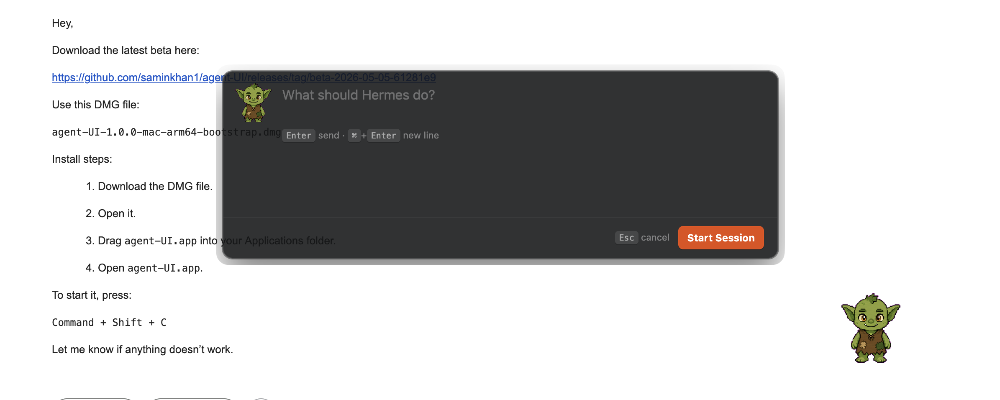

# agent-UI

agent-UI is a thin desktop launcher and status surface for Hermes.

It captures lightweight app/window/display context when the global shortcut fires, then starts the currently selected input mode: text mode opens a minimal task input, while voice mode records through Hermes voice capture and places the transcript in the same input for review before submission.

<p align="center">
  
</p>

## Documentation

- Contributor workflow: [Contributing](CONTRIBUTING.md)
- Release gates and evidence: [Release Guide](docs/RELEASE.md)

## Manual Testing Goal

For manual testers, ship two macOS app variants with the same launcher, voice, pet stack, detail, follow-up, cancel, and thin Hermes auth/model flow:

- `agent-UI for Hermes`: a small connector for users who already have a local Hermes runtime.
- `agent-UI Standalone`: an app-owned Hermes runtime for users who do not know Hermes.

Both variants post prompts to Hermes `local_desktop` `/messages` and read `/events`. agent-UI does not store LLM/provider credentials, does not keep gateway keys in its own config, and does not run a provider-auth preflight. The user starts a task first; if Hermes reports provider/model setup is required, agent-UI opens the thin Hermes auth/model flow and preserves the pending task.

The standalone package includes the local Hermes Agent checkout at `/Users/saminkhan1/Documents/hermes/hermes-agent` by default, preserving local tools and code modifications outside Agent UI-owned overlays. The build always overlays the app-owned `vendor/hermes-platforms/local_desktop` plugin so the packaged gateway matches the app's local desktop contract. The package also includes a self-contained Python 3.11+ runtime with local desktop gateway, messaging, and voice dependencies already resolved. Its app-owned Hermes `.env` stores `LOCAL_DESKTOP_GATEWAY_KEY`, and the app reads it at runtime.

The connector package omits Hermes runtime resources and bundled plugin copies. It resolves and remembers the local Hermes binary path as non-secret config, revalidates it on launch, and connects to the user's existing Hermes `local_desktop` gateway. Category 1 users add or enable the `local_desktop` plugin in Hermes through the Hermes Plugin Path; agent-UI does not install plugins into their Hermes tree.

## Requirements

For developers building the distributable:

- Node.js and npm
- macOS for the mac app build
- `uv` for build-time Python dependency resolution
- a local Hermes Agent checkout; by default the build script uses `/Users/saminkhan1/Documents/hermes/hermes-agent` and records its git SHA, dirty state, and bundled tree hash in the runtime manifest

Developer ID Application signing credentials and Apple notarization credentials are optional for the future public distribution track. The default bootstrapped track does not require a paid Apple Developer plan.

For manual testers using the packaged app:

- macOS
- a Hermes model/provider login or API key configured through Hermes
- microphone permission for voice input mode

## Build A Downloadable macOS App

From the repo root:

```bash
npm install
npm run dist:mac
```

`npm run dist:mac` is the bootstrapped two-app packaging command. It emits connector and standalone DMG + zip artifacts with ad-hoc signed apps, no Apple notarization, and no stapling. This is the no-paid-plan path for direct testers; macOS may require the tester to use Finder's right-click Open approval on first launch.

The future Developer ID path remains available when paid signing and notarization credentials exist:

```bash
npm run dist:mac:developer-id
npm run release:verify:developer-id
```

The bootstrap artifacts are written to `dist/`, for example:

```text
dist/agent-UI-for-Hermes-1.0.0-mac-arm64-bootstrap.dmg
dist/agent-UI-for-Hermes-1.0.0-mac-arm64-bootstrap.zip
dist/agent-UI-Standalone-1.0.0-mac-arm64-bootstrap.dmg
dist/agent-UI-Standalone-1.0.0-mac-arm64-bootstrap.zip
dist/release-manifest.json
```

To bundle a different Hermes checkout:

```bash
HERMES_BUNDLE_SOURCE=/path/to/hermes-agent npm run dist:mac
```

The default standalone build intentionally accepts local Hermes modifications. To force the older clean upstream-release policy for a reproducible baseline build, use:

```bash
HERMES_BUNDLE_SOURCE_POLICY=release npm run dist:mac:standalone:bootstrap
```

The standalone packaging path performs these steps:

1. copies the selected local Hermes checkout into `build/hermes-runtime` without `.git`, source venvs, caches, build outputs, sessions, or logs;
2. overlays the vendored app-owned `vendor/hermes-platforms/local_desktop` plugin into the copied Hermes checkout, and records the action plus SHA-256 in the runtime manifest;
3. creates a bundled `build/hermes-runtime/python` runtime and preinstalls the lean `[voice,messaging]` dependencies needed by local desktop gateway and voice input;
4. builds the Electron main/preload/renderer output;
5. packages `agent-UI Standalone.app` with `build/hermes-runtime` as app resources;
6. ad-hoc signs the bootstrap app and emits DMG + zip artifacts. `dist:mac:developer-id` instead uses Developer ID signing, hardened runtime, notarization, and stapling checks.

The connector packaging path builds the same Electron output as `agent-UI for Hermes.app`, omits `build/hermes-runtime`, and records `v2026.4.30+` as the required local Hermes baseline.

The bundled Hermes launcher does not create user venvs, call `uv`, call `/usr/bin/python3`, or install packages at customer runtime. If the bundled runtime is missing or damaged, it exits with an explicit rebuild error.

## Runtime Gateway Behavior

agent-UI uses the Hermes local desktop gateway. It does not spawn `hermes chat` or keep a local copy of conversation history.

In standalone mode, agent-UI:

1. creates the app-owned Hermes `.env` under `~/.agent-ui/hermes-home/.env` if needed;
2. enables `platforms.local_desktop` in the active Hermes `config.yaml`;
3. reads `LOCAL_DESKTOP_GATEWAY_KEY`, host, and port from that Hermes `.env` file;
4. checks unauthenticated `GET /health` plus a side-effect-free authenticated `POST /messages` schema probe on the local gateway;
5. starts `hermes gateway run --replace` if the gateway is not already running with agent-UI's key, and waits through Hermes' replacement window so quit/reopen can recover from a stale gateway lock or surviving child process;
6. connects to `/events` and posts prompts to `/messages`.

If the default local port is occupied by another process or by a Hermes gateway using a different key, standalone mode automatically moves its bundled gateway to the next available loopback port and rewrites the app-owned Hermes `.env`.

In connector mode, agent-UI reads the default local Hermes profile, remembers the detected Hermes binary path in `~/.agent-ui/connector-runtime.json`, and revalidates it on launch. It may write the required Hermes `config.yaml` and `.env` settings for the local desktop gateway, but it does not install or copy plugins. If the gateway needs a restart, connector mode reports the exact restart command instead of silently replacing the user's local Hermes process.

`GET /health` is unauthenticated. `POST /messages` and `GET /events` require `Authorization: Bearer <LOCAL_DESKTOP_GATEWAY_KEY>`.

Useful overrides:

```bash
export AGENT_UI_HERMES_HOME=~/.agent-ui/hermes-home
export AGENT_UI_HERMES_GATEWAY_URL=http://127.0.0.1:8766
export AGENT_UI_HERMES_GATEWAY_KEY="<gateway secret>"
export AGENT_UI_HERMES_GATEWAY_AUTOSTART=0
```

`AGENT_UI_HERMES_BIN` remains a developer escape hatch. Standalone packaged app startup resolves Hermes from `agent-UI Standalone.app/Contents/Resources/hermes-runtime/bin/hermes`. Connector packaged app startup resolves the remembered or detected local Hermes binary. Neither path searches shell `PATH`.

Gateway mode behavior:

- Uses the current pet `catId` as the stable Hermes `conversation_id`.
- Stores only the last SSE sequence in `~/.agent-ui/hermes-gateway.json` so missed gateway events can replay; conversation content stays with Hermes.
- Sends the first prompt with the existing tagged context metadata.
- Sends first-message slash commands such as `/background ...` without the context wrapper so Hermes can dispatch them normally.
- Sends follow-ups as plain text while Hermes owns same-session busy behavior.
- Sends conversation-window cancel as `/stop` through the same Hermes gateway conversation.
- Reconnects SSE from the last recorded sequence; if the replay window expired, it reconnects live and adds a local sync-gap error item.
- Leaves Hermes session finalization in Hermes core. Follow-up there: decide whether `local_desktop` completion should finalize sessions earlier than idle expiry.

## Clone And Install

```bash
git clone https://github.com/saminkhan1/agent-UI.git agent-UI
cd agent-UI
npm install
npm run verify
```

For contributor workflow and local checks, see [Contributing](CONTRIBUTING.md).

## Run From Source

Use dev mode while working on the app:

```bash
npm run dev
```

Build and preview the production bundle:

```bash
npm run build
npm start
```

## Use As A Local CLI

After installing dependencies, link the package once:

```bash
npm link
```

Then launch it from any terminal:

```bash
agent-ui
```

If the built app is missing, run `npm run build` from the repo root.

## Manual Test Checklist

1. Mount the connector or standalone bootstrap DMG.
2. Drag the app to `/Applications`.
3. Launch from Finder, using right-click Open for the bootstrap Gatekeeper approval if macOS requires it.
4. Confirm the app starts without requiring a terminal.
5. In the app or tray menu, choose `Settings > Input Mode > Text`.
6. Press `Cmd+Shift+C`.
7. Enter a short prompt and submit.
8. Confirm a pet/session appears and streams Hermes output.
9. Open details, send a follow-up, then press Cancel and confirm Hermes stops the active run.
10. Start one `/background ...` task and confirm Hermes accepts it as a slash command.
11. In the app or tray menu, choose `Settings > Input Mode > Voice`.
12. Press `Cmd+Shift+C`, grant macOS microphone permission if prompted, and confirm the prompt window shows voice recording/transcribing state.
13. Confirm the transcribed prompt appears in the text box, edit it if needed, then submit it to start a new session.
14. While the pet overlay is visible, share the active display from FaceTime, Zoom, and Discord, then confirm the share starts and the overlay remains visible in the shared display.
15. Quit/reopen the app and confirm the selected input mode and gateway reconnect path do not show a startup error.

Known first-run cases to check:

- If Hermes has no provider configured, the conversation details should show the actionable Hermes setup/login error instead of a generic failure.
- If microphone permission is missing, the UI should show a recoverable voice error.

## Release Gates

Use the four-ring release workflow for user-downloadable macOS artifacts:

1. Ring 0, local fast checks: `npm test` and `npm run build`. No VMs.
2. Ring 1, GitHub Actions build gate: `.github/workflows/mac-release.yml` runs on pinned `macos-15`, builds connector and standalone bootstrap DMG + zip artifacts from the configured Hermes source, verifies app-mode manifests plus artifact hashes, and uploads artifacts. GitHub runners are only a build gate, not clean-install proof.
3. Ring 2, Tart clean-room gate: run `scripts/tart-clean-room-smoke.sh dist/<standalone-artifact>` against a Cirrus `*-vanilla` image, for example `ghcr.io/cirruslabs/macos-sequoia-vanilla:latest`. The script refuses `base` images, installs the standalone artifact into `/Applications`, poisons `PATH` and fake local-checkout locations, verifies the bundled Hermes runtime, starts the local gateway on `127.0.0.1:8766`, and launches the app.
4. Ring 3, manual customer pass: mount the DMG, drag to `/Applications`, launch from Finder, approve the bootstrap Gatekeeper prompt with right-click Open if needed, confirm TCC microphone prompts, tray/menu behavior, text/voice sessions, follow-up, cancel, background mode, quit/reopen, and clear first-run errors for missing credentials, offline mode, port conflicts, and denied permissions.

After installing a release candidate into `/Applications`, run the installed-app automation before the human Ring 3 pass:

```bash
npm run smoke:installed-release -- "/Applications/agent-UI Standalone.app"
```

The smoke launches the installed app in eval mode with isolated config/Hermes home directories, blocks the default gateway port to exercise port-conflict recovery, drives background mode, follow-up, cancel, conversation-window, and quit/reopen checks, then writes JSON evidence to `/private/tmp/agent-ui-installed-release-smoke-*`.

After Ring 1 packaging, run:

```bash
npm run release:verify
```

This writes `dist/release-manifest.json` with app mode, app version, git SHA, app source dirty status, connector Hermes baseline or standalone bundled Hermes provenance, whether Hermes runtime is included, signing identity, notarization status, and SHA-256 hashes for every DMG/zip artifact. For standalone, provenance includes the Hermes source path, source policy, git SHA, release-tag SHA when available, dirty state, dirty file list, and bundled tree hash. In bootstrap signing mode, `notarizationStatus` is recorded as `not_applicable_bootstrap`; `spctl` and stapler results are still captured as evidence but are not required to pass.

For release verification, private bootstrap distribution, manual customer checks, and evidence notes, see [Release Guide](docs/RELEASE.md). The customer-facing download link should be the GitHub Release page, not a GitHub Actions artifact link.

## Verify

```bash
npm test
npm run build
npm run bundle:hermes
npm run dist:mac
npm run release:verify
```

The gateway client/runtime are part of the Electron main process bundle. `npm run build` should emit:

```text
out/main/hermes-gateway-client.js
out/main/hermes-runtime.js
```
